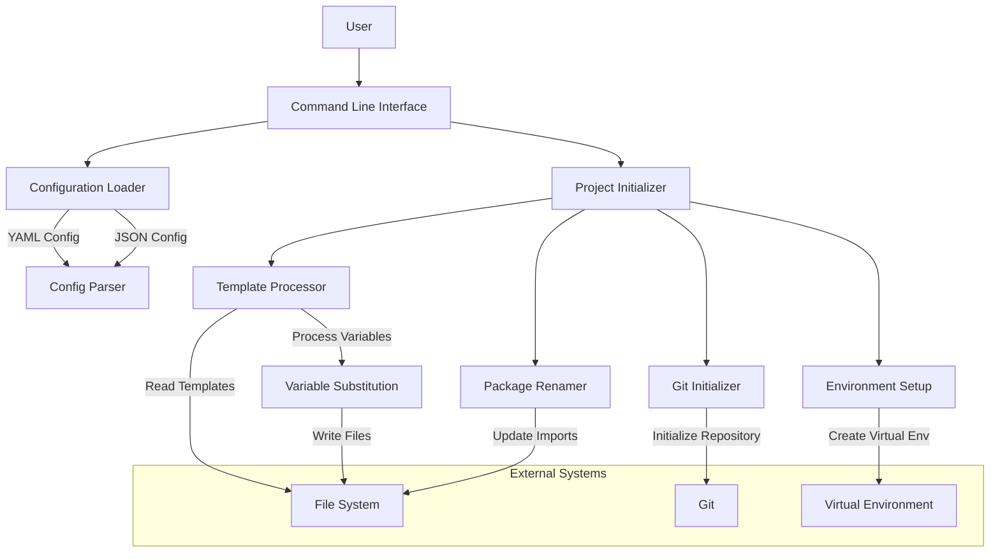

# Project Initialization System Architecture

This document describes the architecture of the Project Initialization System.

## System Components

## Component Descriptions

### Command Line Interface (CLI)

Handles user input, parses command-line arguments, and orchestrates the initialization process.

### Configuration Loader

Loads and validates configuration from YAML or JSON files, merging with default values.

### Project Initializer

Coordinates the overall project initialization process, delegating to specialized components.

### Template Processor

Processes template files, replacing variables with user-provided values.

### Package Renamer

Renames Python packages and updates import statements throughout the codebase.

### Git Initializer

Sets up a Git repository, creates an initial commit, and configures Git settings.

### Environment Setup

Creates and configures a Python virtual environment for the project.

## Data Flow

1. User provides configuration via command-line arguments or configuration files
1. Configuration is loaded, validated, and merged with defaults
1. Template files are processed, with variables replaced by configuration values
1. Python packages are renamed according to the configuration
1. A Git repository is initialized (unless skipped)
1. A virtual environment is created and configured (unless skipped)

## Extension Points

The system is designed to be extensible in the following ways:

1. **Custom Templates**: Users can create their own project templates
1. **Configuration Presets**: Common configurations can be saved as presets
1. **Plugin System**: Future versions may support plugins for custom initialization steps
