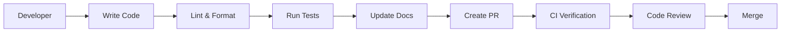

# Reference Python Project Architecture

This document describes the architecture of the Reference Python Project template.

## System Overview

```mermaid
graph TD
    CLI[CLI Application] --> Core[Core Components]
    Core --> DataPipelines[Data Pipelines]
    Core --> Infrastructure[Infrastructure]
    Core --> Utils[Utilities]

    DataPipelines --> AWS[AWS Integration]
    Infrastructure --> Terraform[Terraform Modules]
    Infrastructure --> CloudFormation[CloudFormation Templates]

    subgraph Development Tools
        Testing[Testing Framework]
        Documentation[Documentation System]
        Linting[Code Quality Tools]
        CI[Continuous Integration]
    end

    Core --> Development Tools
```

## Key Components

### Core Package Structure

The project is organized into modular packages with clear separation of concerns:

1. **enterprise_data_engineering**: Main package containing enterprise-ready data engineering tools

   - **cli**: Command-line interface components
   - **common_utils**: Shared utility functions
   - **data_pipelines**: Data transformation and processing
   - **spark**: Apache Spark integration utilities
   - **compat**: Compatibility layer for different Python versions

1. **reference_python_project**: Reference implementation with examples

   - **cli**: Command-line tools and examples
   - **utils**: Utility functions and helpers

### Design Principles

The template follows these architectural principles:

1. **Separation of Concerns**: Each module has a clear, single responsibility
1. **Interface Stability**: Public APIs are designed for long-term stability
1. **Dependency Inversion**: High-level modules don't depend on low-level modules
1. **Composition Over Inheritance**: Prefer object composition to class inheritance
1. **Configuration as Code**: All settings are managed in version-controlled files

## Development Workflow



The template enforces a consistent development workflow:

1. **Local Development**: Write code with VS Code integration
1. **Pre-commit Hooks**: Automatically format and lint code
1. **Testing**: Run tests with pytest and coverage reporting
1. **Documentation**: Update documentation with code changes
1. **CI/CD**: Automated verification through GitHub Actions

## Infrastructure Integration

The template provides infrastructure components for cloud deployment:

1. **Terraform Modules**: Reusable modules for AWS infrastructure
1. **CloudFormation Templates**: AWS resource definitions
1. **Docker Support**: Containerization for consistent environments
1. **CI/CD Workflows**: GitHub Actions for deployment pipelines

## Extension Points

The system is designed to be extensible in the following ways:

1. **Custom Modules**: Add new functionality by creating additional packages
1. **Infrastructure Expansion**: Add templates for additional cloud providers
1. **Pipeline Components**: Create new data pipeline processing elements
1. **CLI Commands**: Extend the CLI with new commands

## Security Design

Security is embedded throughout the architecture:

1. **Dependency Scanning**: Automatic vulnerability scanning
1. **Secret Management**: Secure handling of credentials
1. **Least Privilege**: IAM policies following least-privilege principle
1. **Code Scanning**: Static analysis for security issues

## Future Direction

The architecture supports planned enhancements:

1. **Multi-cloud Support**: Expand infrastructure beyond AWS
1. **Data Mesh Patterns**: Support for domain-oriented data architectures
1. **ML Operations**: Machine learning deployment pipelines
1. **Compliance Automation**: Built-in compliance checks and documentation
